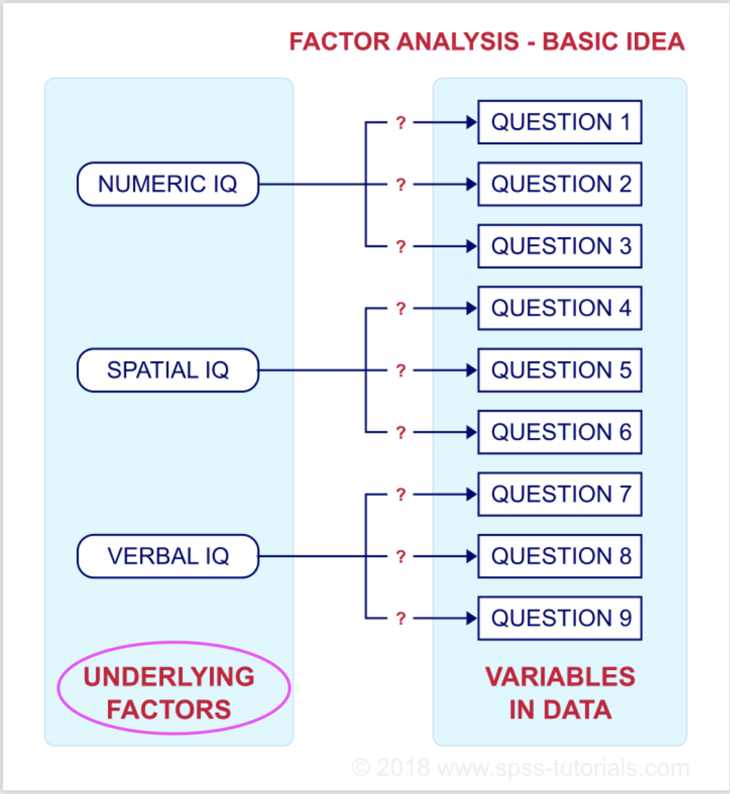
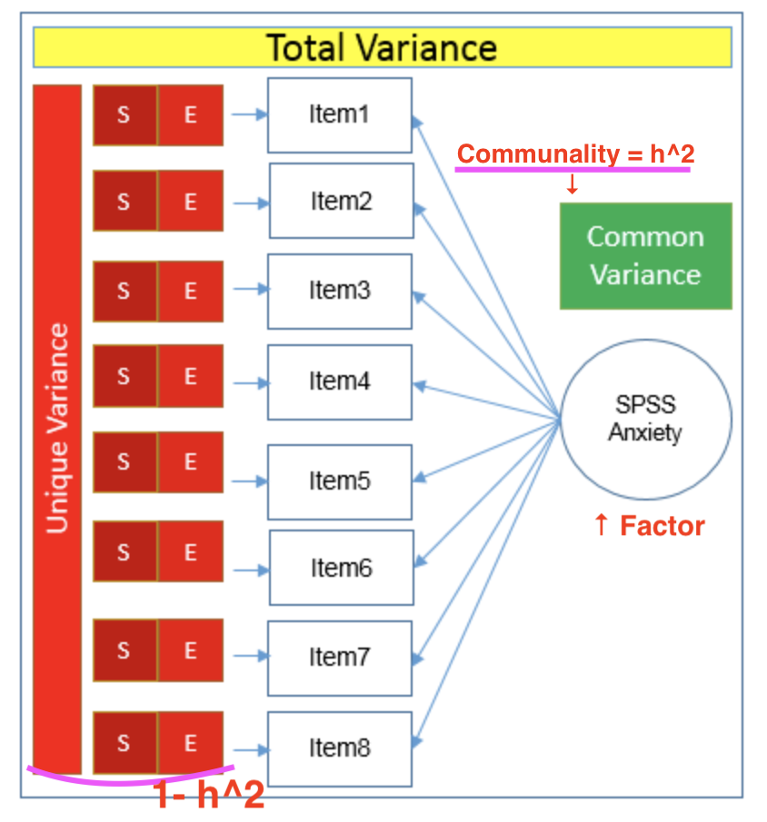

# Glossary 3 (Factor Analysis)

```{r 3-1, include=FALSE}
library(psych)
library(GPArotation)
library(FactoMineR)
```

## Factor
  
  Factor is a classified element from which it is being a cause in general, in factor analysis, factor means the underlying variables which is smaller than the observed variables, explains how those observed variables are interrelated each other. 
    Factor analysis is aiming to model the interrelationships among items which is explained by the found factors. The relation between observed variables and factors are shown in following image. 

{ width=40% }

## Communalities
  
  Communality describes a common variance which ranges between 0 and 1 in factor analysis, symbol of communality is shown as h^2 (see the notation below). The common variance is the shared variance among the items, as more these items are strongly related from each other, shared variance gets larger. Communalities give how well the model performs, if communality is closer to 1, it means that the extracted factors by the analysis explain more variance of an item. In that case, the model explains better. The total variance in factor analysis is consisted from common variance and unique variance which is composed of specific(S) and error(E) variance (see image below).The individual communarities tell how it is explained for individual variables, overall communarities gives an overall assessment of the performance. 

$$
\hat{h}_i^2 = {\sum_{j=1}^m} \hat{l}_{ij}^2
$$

{ width=40% }
  
  In comparison, in PCA, the communality is the sum of extracted proportion of variance of selected components.In PCA, unique variance is not taken into account. Thus, if the communalities across all items are summed up, it is equal to total variance. The sum of eigenvalues of each component is also equal to the total variance, therefore, those communalities and eigenvalues are equal in PCA. 
  When the total variance is 1, then common variance = communality. 

## Factor loadings
  
  Factor loadings are the correlation coefficients between the variables and factors in factor analysis and PCA. It shows how much the variance in the variable is explained by the factor. Loadings can be between -1 to 1, close to -1 and 1 means that the factor influences strongly towards the variable, close to 0 means the influence is weak. 
  If a variable has more than one significant factor loadings, it is called as cross loadings which is hard to interpret. In this case, rotation of factor loadings is proceeded, so that the factor loadings are redistributed as each variable measures only one factor. 
  Following example shows the solution of factor loadings of data "Thurstone" between factors (RC1-RC3) and variables which are indicating the ability items.

```{r 3-2, message=FALSE}
data(Thurstone)
fa3 <- principal(r = Thurstone,
  nfactors = 3,
  n.obs = 213)
print(fa3$loadings, cutoff=0, digits=3)
```

## Factor values (Factor scores)
  
  When factor loadings are low, or looks very different from each other, it is possible to create an index which reflects the inequality of association between items and the factor, which are the factor scores. Factor scores are the estimated values of factors, optimally weighted linear combination of the items, creating the index variable. Each item's weight is derived from its factor loading, thus, each item's contribution to the factor score depends on how strongly it relates to the factor. The reason why factor scores are essentially weighted sum of the items is that those weights are between -1 to 1, the scale of the factor scores would be varied from a pure sum. 
    
## Anti-image correlation matrix
  
  Anti-image is a part of variable which cannot be predicted, since the image of a variable is defined as a part which is predictable by regressing each variables. Anti-image correlation matrix indicates how the items are correlated in the matrix, it summarizes the most important information about partial correlations. Thus, helping to indicate the part of variables which is not predictable. The diagonal values are the KMO(explained later) measures of sampling adequacy, the off-diagonal values are showing the negative of the pairwise partial correlation coefficients. Most of the off-diagonal elements should be small so that the factor analysis model can be considered as having better goodness. 
    Following figure is showing the example from the data of "Thurstone".
    
```{r 3-3}
cor(Thurstone, use="pairwise")
```


## Kaiser-Meyer-Olkin criterion (KMO)
  
  Kaiser-Meyer-Olkin criterion (KMO) is a modified version of the Measure of Sampling Adequacy (MSA, will be explained below), by Kaiser and Rice (1974). It indicates the degree of each variables in a dataset can be predicted without error which caused by other variables. This analysis is relying on anti-image correlation matrix, measured by 0 to 1, value 0 means that the sum of partial correlation is large compared to the sum of correlations which means the correlations are wide spread, this is indicating the factor analysis is not likely be appropriate. Thus, if the value is closer to 1, the dataset is considered as suitable for factor analysis. 
   Mathematical notation is as follows.
$$
KMO =  \frac {\sum_{i=1}^k \sum_{j=1}^k r_{ij}^2} {\sum_{i=1}^k \sum_{j=1}^k r_{ij}^2 + a_{ij}^2} ,   i\ne j
$$

## Measure of Sampling Adequacy (MSA)
  
  Measure of Sampling Adequacy (MSA) is introduced by Kaiser(1970) before he modified Kaiser Meyer-Olkin criterion. This is a statistical value used as an index for deciding if the sample is suitable for performing factor analysis or not. It calculates the measure of 0 to 1, as the result is closer to 1, it is better, 0.6 is the suggested minimum. It is mentioned that MSA increases 1)when the number of variables increases, 2)when the effective number of factors increases, 3)when the overall level of correlation increases, and 4)when sample size of individuals increases. 
  Mathematical notation is as follows.

$$
MSA_i =  \frac {\sum_{j=1}^k r_{ij}^2} {\sum_{j=1}^k r_{ij}^2 + a_{ij}^2} ,   j \ne i
$$

Given these explanation, KMO has been applied to the data of "Thurstone".

```{r 3-4, message=FALSE}
KMO(Thurstone)
```

Considering the value, overall value and all of values for each item are higher than 0.6, very close to 1, it can be assumed that the data is suitable for factor analysis. 


## References

Cerny.B.A. and Kaiser.H.F.(2010). A Study Of A Measure Of Sampling Adequacy For Factor-Analytic Correlation Matrices. Taylor & Francis Online. [online].Retrieved from https://www.tandfonline.com/doi/abs/10.1207/s15327906mbr1201_3 [accessed on 15.06.2020]. 

Lüdecke.D., Makowski.D.and Mattan.S.B.S. Kaiser, Meyer, Olkin (KMO) Measure of Sampling Adequacy (MSA) for Factor Analysis.[online].Retrieved from https://easystats.github.io/parameters/reference/check_kmo.html [accessed on 15.06.2020]. 

Le Roux.B.and Rouanet.H. (2004). Geometric Data Analysis. Kluwer Academic Publishers. 

PennEtate Eberly College of Science. (2020).12.5 - Communalities. The Pennsylvania State University. [online]. Retrieved from https://online.stat.psu.edu/stat505/lesson/12/12.5 [accessed on 16.06.2020].

Quicl.J. M. (2014). R Tutorial Series. [online].Retrieved from http://rtutorialseries.blogspot.com/2011/10/r-tutorial-series-exploratory-factor.html [accessed on 15.06.2020]. 

Revelle. W.(2019). How To: Use the psych package for Factor Analysis and data reduction. Department of Psychology
Northwestern University. [online]. Retrieved from http://personality-project.org/r/psych/HowTo/factor.pdf [accessed on 15.06.2020]

Revelle. W.(2020). Package ‘psych’. CRAN.[online].Retrieved from https://cran.r-project.org/web/packages/psych/psych.pdf [accessed on 15.06.2020]

Stata. (2020). Glossary Factor analysis. Stata.[online].Retrieved from https://www.stata.com/manuals13/mvglossary.pdf [accessed on 15.06.2020]

UCLA.(2020). A Practical Introduction to Factor Analysis: Exploratory Factor Analysis.UCLA Statistical Consulting.[online].Retrieved from https://stats.idre.ucla.edu/spss/seminars/introduction-to-factor-analysis/a-practical-introduction-to-factor-analysis/ [accessed on 15.06.2020]. 

Van den Berg.R.G. (2020). SPSS Factor Analysis – Beginners Tutorial. SPSS Tutorials.[online].Retrieved from https://www.spss-tutorials.com/spss-factor-analysis-tutorial/ [accessed on 15.06.2020]. 


